# Trabajo Práctico

## [TA046] Ingeniería de Software I

### Curso 2
Segundo cuatrimestre de 2024

---

### Grupo 6
### Integrantes 

| Apellido y Nombre             | Padrón  |
|-------------------------------|----------|
| Converso, Lara Daniela        | 107632   |
| Galindez, María               | 105741   |
| De San Vicente, Hernan Martin | 108800   |
| Cuevas, Juan Francisco        | 107963   |
| Ahumada, Lorenzo Sebastian    | 106780   |
| Fernandez, Milton Tomas       | 108749   |

---

## ¿Cómo correr el proyecto?

### Set up repo en local
Para clonar el repositorio en local, debemos correr la línea:

```bash
git clone https://gitlab.com/Laraconverso/is1_grupo6.git
```

### Levantar con Docker el proyecto

**Advertencia:** En el caso de que sea la primera vez corriendo el proyecto, verificar que en el archivo `.../resources/application.properties` la configuración de la base de datos esté en "create". Este debería verse de la siguiente manera:

```properties
spring.application.name=back-end
spring.jpa.hibernate.ddl-auto=create
```

Una vez hecho esto, se debe correr el siguiente comando:

```bash
docker-compose up --build
```

En caso de querer tirar abajo todos los contenedores, se debe correr este comando:

```bash
docker-compose down
```

Si se desea detener un único contenedor, se corre el siguiente comando, reemplazando `<container>` por el nombre del contenedor:

```bash
docker compose stop <container>
```

### Levantar en local el proyecto
Simplemente se corre el proyecto haciendo el *run* necesario.

---

## UI

A continuación, se presentan capturas de las diferentes páginas del sistema desarrollado:

### Página de Inicio
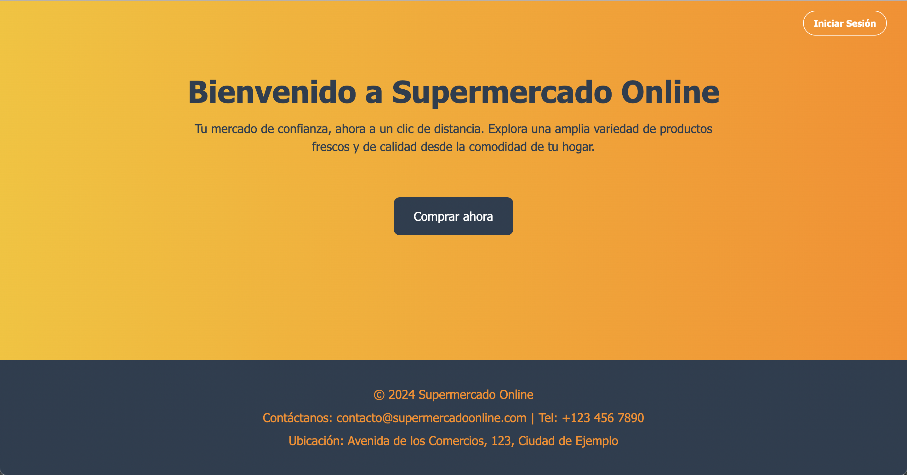

### Página de Inicio de Sesión
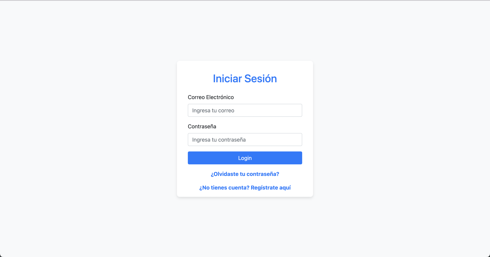

### Página de Registro de Usuario
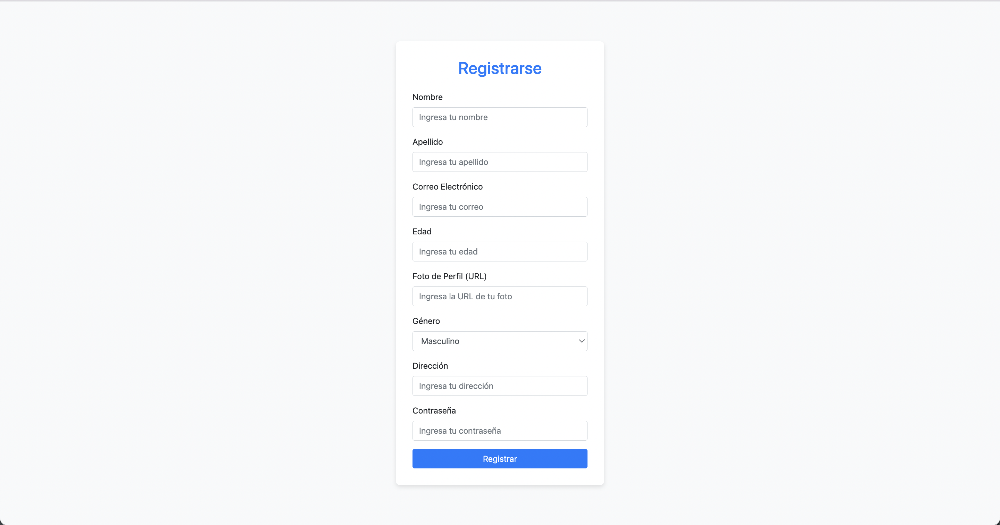

### Página de Recupero de Contraseña
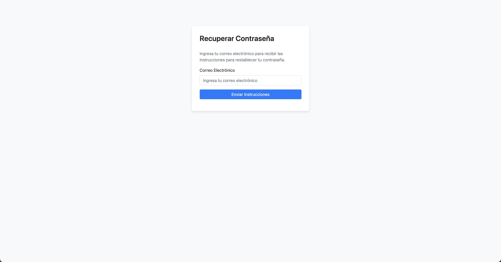

### Página de Compra
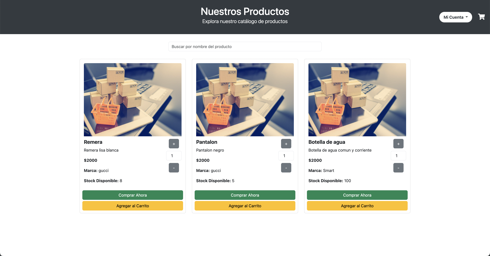

### Página de Carrito
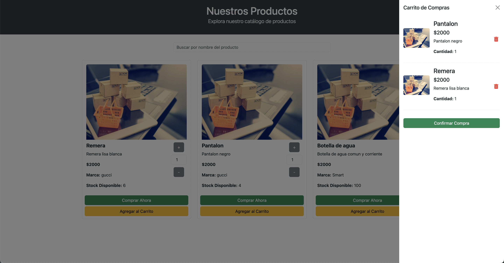

### Página de Gestión de Pedidos
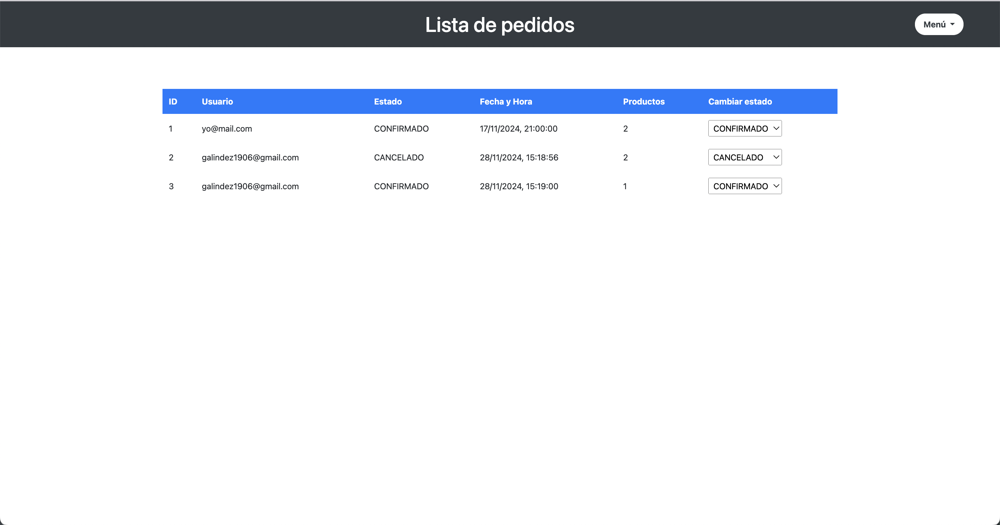

### Página de Gestión de Stocks
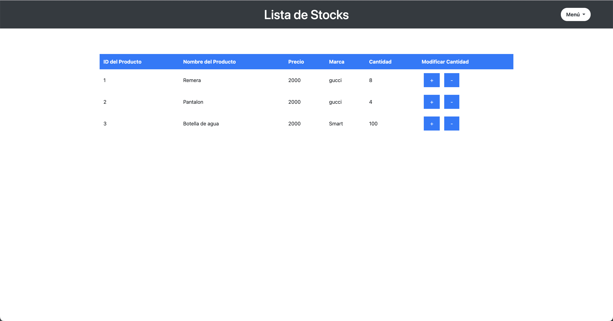

### Página de Gestión de Validaciones
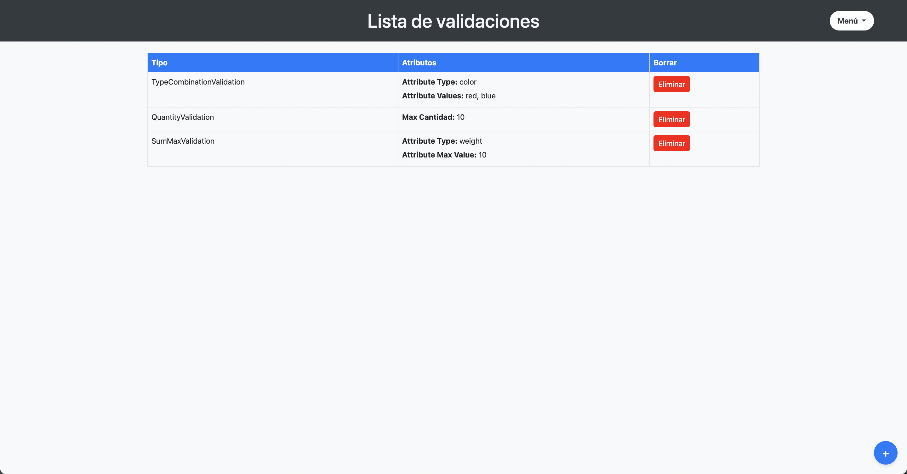
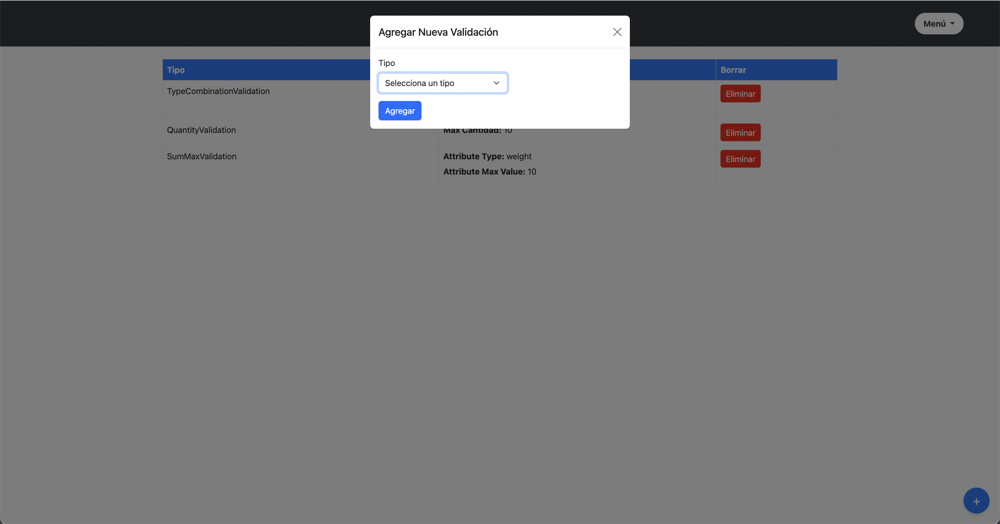

### Página de Gestión de Productos
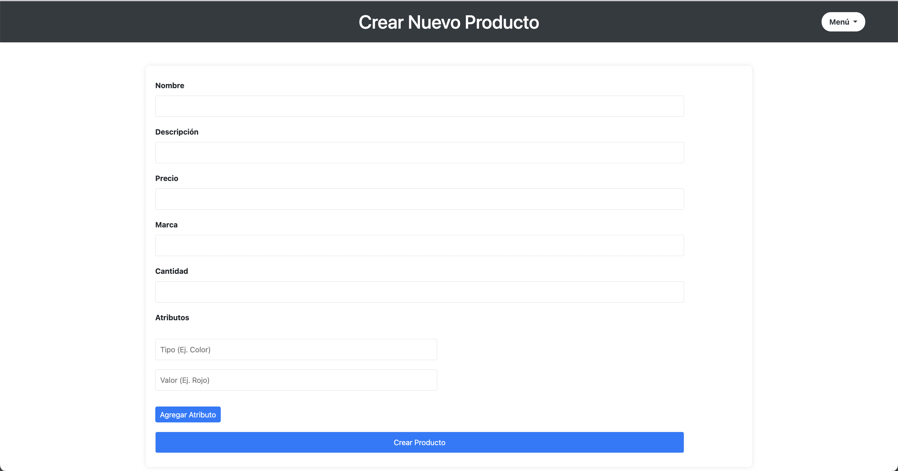

### Página de Mis Pedidos
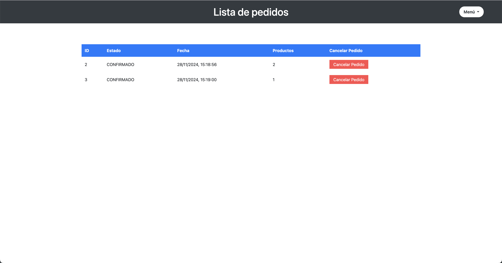

